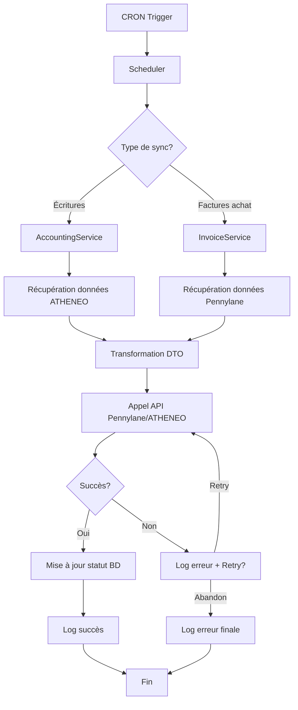

# Architecture - Interface ATHENEO ↔️ PENNYLANE

## 📋 Vue d'ensemble

Cette application Spring Boot est une **interface bidirectionnelle** synchronisant les données comptables entre :
- **ATHENEO** : ERP SQL Server (système existant)
- **PENNYLANE** : Plateforme comptable cloud (API REST)

### Fonctionnalités principales

| Flux | Direction | Description |
|------|-----------|-------------|
| **Écritures comptables** | ATHENEO → Pennylane | Export des factures de vente, clients, produits |
| **Factures d'achat** | Pennylane → ATHENEO | Import des factures fournisseurs |
| **Règlements** | Pennylane → ATHENEO | Synchronisation des paiements |
| **Statuts** | Bidirectionnel | Mise à jour des statuts de factures |

---

## 🏗️ Architecture logicielle

### Architecture en couches (Layered Architecture)

```
┌─────────────────────────────────────────────────┐
│          LAYER 1 : PRESENTATION                 │
│  - Controllers (REST endpoints, Web UI)         │
│  - Schedulers (Cron jobs)                       │
└────────────────┬────────────────────────────────┘
                 │
┌────────────────▼────────────────────────────────┐
│          LAYER 2 : SERVICE (Business Logic)     │
│  - AccountingService                            │
│  - InvoiceService                               │
│  - DocumentService, WsDocumentService           │
└────────────────┬────────────────────────────────┘
                 │
┌────────────────▼────────────────────────────────┐
│          LAYER 3 : INTEGRATION                  │
│  - API Clients (InvoiceApi, CustomerApi...)     │
│  - Mappers (DTO ↔ Entity)                       │
└────────────────┬────────────────────────────────┘
                 │
┌────────────────▼────────────────────────────────┐
│          LAYER 4 : DATA ACCESS                  │
│  - Repositories (JPA)                           │
│  - Entities (ORM)                               │
└────────────────┬────────────────────────────────┘
                 │
┌────────────────▼────────────────────────────────┐
│          LAYER 5 : EXTERNAL SYSTEMS             │
│  - SQL Server (ATHENEO)                         │
│  - Pennylane REST API                           │
│  - SOAP Web Service (Documents)                 │
└─────────────────────────────────────────────────┘
```

---

## 📦 Structure des packages

```
fr.mismo.pennylane/
├── api/                        # Clients API externes
│   ├── AbstractApi.java       # Classe de base (headers, rate limiting, errors)
│   ├── ApiException.java      # Exception personnalisée
│   ├── InvoiceApi.java        # API factures Pennylane
│   ├── CustomerApi.java       # API clients
│   ├── ProductApi.java        # API produits
│   ├── AccountsApi.java       # API comptes comptables
│   └── SupplierApi.java       # API fournisseurs
│
├── configuration/              # Configuration Spring
│   ├── SecurityConfig.java    # Configuration sécurité
│   └── RestTemplateConfig.java
│
├── controller/                 # Endpoints REST & UI
│   └── LogController.java     # Dashboard de logs
│
├── dao/                        # Accès aux données
│   ├── entity/                # Entités JPA
│   │   ├── SiteEntity.java
│   │   ├── CourrierEntity.java
│   │   └── ...
│   └── repository/            # Repositories Spring Data JPA
│       ├── EcritureRepository.java
│       ├── FactureRepository.java
│       ├── LogRepository.java
│       └── ...
│
├── dto/                        # Data Transfer Objects
│   ├── ath/                   # DTOs ATHENEO
│   ├── invoice/               # DTOs factures
│   ├── customer/              # DTOs clients
│   ├── product/               # DTOs produits
│   └── accounting/            # DTOs comptables
│
├── Scheduler/                  # Tâches planifiées (CRON)
│   ├── schedulerAccounting.java
│   └── schedulerPurchases.java
│
├── service/                    # Logique métier
│   ├── AccountingService.java # Orchestration écritures comptables
│   ├── InvoiceService.java    # Traitement factures
│   ├── CategoryCacheService.java
│   ├── DocumentService.java
│   ├── WsDocumentService.java
│   ├── LogHelper.java
│   ├── *Mapper.java           # Mappers DTO ↔ Entity
│   └── ...
│
├── settings/                   # Classes de configuration
│   └── WsDocumentProperties.java
│
└── util/                       # Classes utilitaires
    ├── RateLimiter.java       # Gestion des quotas API
    ├── ApiConstants.java      # Constantes centralisées
    └── StringUtils.java       # Utilitaires chaînes
```

---

## 🔄 Flux de données principaux

### 1. Synchronisation des écritures (ATHENEO → Pennylane)

```
┌──────────────┐     CRON      ┌────────────────────┐
│  Scheduler   │──────────────▶│ AccountingService  │
│  Accounting  │               └──────┬─────────────┘
└──────────────┘                      │
                                      ├─▶ processProducts()
                                      ├─▶ processInvoice()
                                      ├─▶ processCustomer()
                                      └─▶ processCourrier()
                                              │
                        ┌─────────────────────┴──────────────────┐
                        │                                        │
                  ┌─────▼──────┐                         ┌──────▼──────┐
                  │ ProductApi │                         │ InvoiceApi  │
                  │ CustomerApi│                         │ AccountsApi │
                  └─────┬──────┘                         └──────┬──────┘
                        │                                       │
                        └───────────────┬───────────────────────┘
                                        │
                                  ┌─────▼─────┐
                                  │ Pennylane │
                                  │    API    │
                                  └───────────┘
```

**Étapes :**
1. Le scheduler déclenche `syncEntries()` selon le CRON configuré
2. Récupération des lots d'écritures à exporter depuis ATHENEO
3. Pour chaque facture :
   - Création/MAJ des produits
   - Création/MAJ de la facture
   - Création/MAJ du client
   - Attachement du PDF si disponible
4. Logging des résultats dans la table T_LOG_PENNYLANE

### 2. Import des factures fournisseurs (Pennylane → ATHENEO)

```
┌──────────────┐     CRON      ┌────────────────────┐
│  Scheduler   │──────────────▶│  InvoiceService    │
│  Purchases   │               └──────┬─────────────┘
└──────────────┘                      │
                                      │ syncInvoice()
                                      ▼
                              ┌───────────────┐
                              │  InvoiceApi   │
                              │  SupplierApi  │
                              │  AccountsApi  │
                              └───────┬───────┘
                                      │
                                ┌─────▼─────┐
                                │ Pennylane │
                                │    API    │
                                └─────┬─────┘
                                      │
                              ┌───────▼──────────┐
                              │ DocumentService  │
                              │ (Download PDF)   │
                              └───────┬──────────┘
                                      │
                              ┌───────▼──────────┐
                              │ WsDocumentService│
                              │ (Upload to       │
                              │  ATHENEO)        │
                              └──────────────────┘
```

**Étapes :**
1. Récupération des factures fournisseurs via API Pennylane
2. Filtrage selon les catégories configurées
3. Insertion dans T_A_FACTURE_PENNYLANE
4. Téléchargement du PDF depuis Pennylane
5. Upload du PDF dans ATHENEO via SOAP

---

## 🔧 Composants techniques

### Base de données (SQL Server)

**Tables principales :**
- `T_V_FACTURE` : Factures de vente
- `T_A_FACTURE_PENNYLANE` : Factures d'achat Pennylane
- `T_V_FACTURE_LIGNE` : Lignes de factures
- `T_LOT_ECRITURE_PENNYLANE` : Lots d'écritures à synchroniser
- `T_SOCIETE` : Clients/Fournisseurs
- `T_PRODUIT` : Produits
- `T_SITE` : Configuration multi-sites
- `T_LOG_PENNYLANE` : Logs applicatifs

**Stored Procedures :**
- 48 procédures stockées dans `/structure/`
- Préfixe `SP_PENNYLANE_*`
- Gestion des écritures, factures, règlements

### API Pennylane

**Endpoints utilisés :**
- `/customer_invoices` : Factures clients
- `/supplier_invoices` : Factures fournisseurs
- `/customers` : Clients
- `/products` : Produits
- `/plan_items` : Plan comptable
- `/suppliers` : Fournisseurs
- `/categories` : Catégories de factures

**Authentification :**
- Bearer Token par site (stocké dans `SiteEntity.pennylaneToken`)
- Rate limiting : 100 appels/minute (géré par `RateLimiter.java`)

### Tâches planifiées (CRON)

| Tâche | CRON | Fonction |
|-------|------|----------|
| `syncEntries` | Configurable | Synchronisation écritures comptables |
| `UpdateSale` | Configurable | Mise à jour statuts factures |
| `SyncPurchases` | Configurable | Import factures fournisseurs |
| `UpdatePurchaseReglement` | Configurable | MAJ règlements |
| `purgeLogs` | Configurable | Purge des logs anciens |

---

## 🔒 Sécurité

### ⚠️ Points d'attention actuels

1. **Credentials hardcodés** dans `application.yml`
   - ❌ Database credentials
   - ❌ Web service credentials
   - ✅ **Recommandation :** Utiliser des variables d'environnement

2. **Sécurité désactivée** dans `SecurityConfig.java`
   - ❌ CSRF disabled
   - ❌ Tous les endpoints publics
   - ✅ **Recommandation :** Implémenter authentification

3. **Tokens en clair** dans la base de données
   - ❌ Pas de chiffrement des tokens Pennylane
   - ✅ **Recommandation :** Chiffrer les tokens au repos

Voir [SECURITY_RECOMMENDATIONS.md](SECURITY_RECOMMENDATIONS.md) pour les détails.

---

## 🚀 Performance & Optimisations

### Améliorations récentes

1. **Rate Limiting centralisé**
   - ✅ Remplacement des 23 `Thread.sleep()` par `RateLimiter`
   - ✅ Gestion intelligente des quotas par endpoint
   - ✅ Algorithme Token Bucket

2. **Code mutualisé**
   - ✅ `AbstractApi` centralise headers, exceptions, rate limiting
   - ✅ `StringUtils` pour les utilitaires dupliqués
   - ✅ `ApiConstants` pour les magic numbers

3. **Gestion d'erreurs améliorée**
   - ✅ `ApiException` avec codes HTTP et retry logic
   - ✅ Logging structuré via `LogHelper`

### Points d'amélioration futurs

- [ ] Implémenter le caching (Spring Cache) pour les catégories et comptes
- [ ] Batching des requêtes API (éviter N+1)
- [ ] Pagination des gros volumes
- [ ] Async processing pour les tâches longues

---

## 📊 Monitoring & Logging

### Dashboard Web
- **URL :** `/logs/dashboard`
- **Fonctionnalités :**
  - Recherche de logs
  - Visualisation des erreurs
  - Analyse des traitements lents
  - Détails des logs par référence

### Table de logs
**T_LOG_PENNYLANE** contient :
- Traitements métier (SYNC_INVOICE, UPDATE_SALE, etc.)
- Durée d'exécution
- Erreurs détaillées
- Références métier (N° facture, N° lot)

---

## 🧪 Tests

### Couverture actuelle
- ✅ 51 tests unitaires créés
- ✅ Services métier (AccountingService, InvoiceService)
- ✅ Schedulers
- ⚠️ Pas de tests d'intégration
- ⚠️ Pas de tests API

### À développer
- [ ] Tests d'intégration avec TestContainers (SQL Server)
- [ ] Tests API avec WireMock (Pennylane)
- [ ] Tests de performance et charge

---

## 🛠️ Configuration multi-environnements

### Profils Spring
- **dev** : Développement local
- **prod** : Production

### Variables clés
```yaml
# CRON jobs
cron:
  Entries: "*/10 * * * * *"  # Sync écritures
  UpdateSale: "-"            # Disabled
  Purchases: "-"             # Disabled

# Database
spring.datasource.url: ${DB_URL}
spring.datasource.username: ${DB_USER}
spring.datasource.password: ${DB_PASSWORD}

# Pennylane (par site)
# Tokens stockés dans T_SITE.PENNYLANE_TOKEN
```

---

## 📝 Conventions de code

### Naming
- **Classes** : PascalCase (ex: `AccountingService`)
- **Méthodes** : camelCase (ex: `syncEcriture()`)
- **Constantes** : UPPER_SNAKE_CASE (ex: `MAX_CALLS_PER_MINUTE`)
- **Packages** : lowercase (ex: `fr.mismo.pennylane.service`)

### Logging
```java
log.trace("Détails techniques");     // Très verbeux
log.debug("Informations debug");     // Debug
log.info("Actions métier");          // Nominal
log.warn("Situations anormales");    // Attention
log.error("Erreurs", exception);     // Erreurs
```

### Annotations
- `@Service` : Logique métier
- `@Component` : Composants génériques
- `@Transactional` : Gestion des transactions
- `@Scheduled` : Tâches planifiées
- `@Slf4j` : Logging Lombok

---

## 🔄 Cycle de vie d'une synchronisation



---

## 📚 Ressources

### Documentation externe
- [API Pennylane](https://pennylane.readme.io/reference/getting-started)
- [Spring Boot 3.3.0](https://docs.spring.io/spring-boot/docs/3.3.0/reference/html/)
- [Spring Data JPA](https://docs.spring.io/spring-data/jpa/docs/current/reference/html/)

### Documentation interne
- [IMPROVEMENTS.md](IMPROVEMENTS.md) : Améliorations de fiabilité et tests
- [SECURITY_RECOMMENDATIONS.md](SECURITY_RECOMMENDATIONS.md) : Recommandations sécurité
- [README.md](README.md) : Guide de démarrage rapide

---

**Version :** 1.10.2
**Dernière mise à jour :** 2025-11-27
**Auteur :** Claude Code
